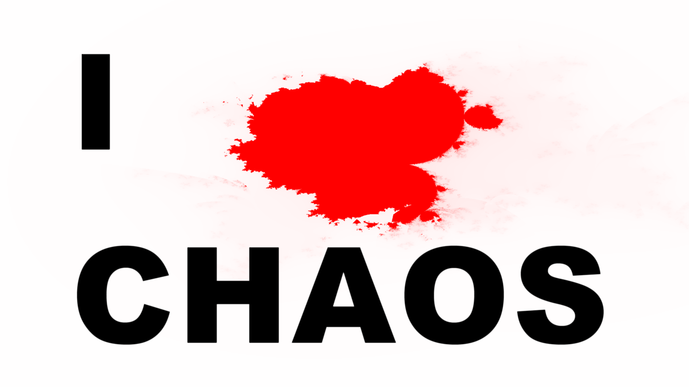

# VJ Spack-O-Mat FFGL Plugins 

          
this repository is a huge development repository for plugins by VJ-Spack-O-Mat
<!-- TOC -->
- [QuickStart](#quickstart)
- [Mission Statement](#mission-statement)
  - [Who is VJ Spack-O-Mat and why](#who-is-vj-spack-o-mat-and-why)

<!-- TOC END -->
# QuickStart

- for downloading binaries and documentation
    [Spack-O-Mat Plugins Binaries](release)
    
- for developing with this repository
    [Spack-O-Mat Plugin Development](DEVELOPMENT.md)

# Mission Statement

## Who is VJ Spack-O-Mat and why

__Christian Kleinhuis__ - former administrator of [www.fractalforums.com](http://fractalforums.com), succeeded by [fractalforums.org](http://fractalforums.org) - is __VJ Spack-O-Mat__. 

__Christian__ and the __VJ__ together with the folks at [ChaosTube](https://www.youtube.com/channel/UCej4aqqeusL5iUnKHjmKjLQ) Youtube channel - which are __Christian Kleinhuis__ as well (*speaker*,*artist*,*scientist*,*keeper*) - follow a huge goal, the goal is to create a popular stimulating didactory experience 
for introducing the [Chaos Theory](https://www.wikiwand.com/en/Chaos_theory) to the world. 

This shall be a physical space with musical resting and dancing opportunities - _the cafe_ -, a free for everyone area to introduce the abstract theory behind chaos theory using interactive tutorials - _the classroom_ -, an area where contemporary digital art is exhibited, providing the possibility for each participating artist in earning money from the exposure, hence this area will have an entry fee - _the exhibition_ - and finally the fourth level is christian's own massive digital playground featuring the stuff he has already experienced: [interactive kinect usage](https://youtu.be/sasvx7GcIT4?t=64) - safe laser experiments [https://github.com/trifox/laserapi](LaserApi), touch screen floors using various fractal generation techniques or plain [https://github.com/trifox/ShaderMaker](Resolume) plugins :) and everything that might be of his personal interest who knows ...  - _the mutatorkammer_.

The concept shall barry itself, selling drinks, food (broccoli) and merchandise should produce the income needed to supply the above
mentioned spaces around the world spreading knowledge and letting most of the money create either other spaces or sense full contributions to the development of the world - where not only art and free minded spaces carry on but following mostly the golden rule to participate in any outcomings ... 
 
    
