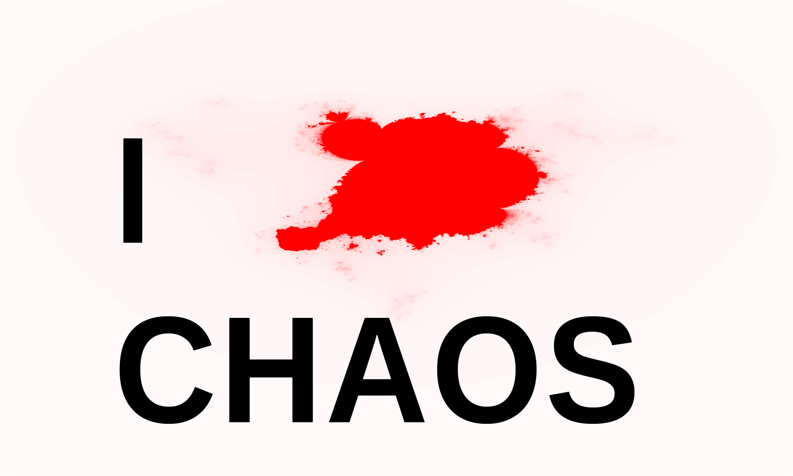

# VJ Spack-O-Mat FFGL Plugins development repo

this repository is a huge development repository for plugins by VJ-Spack-O-Mat

# Mission Statement

## Who is VJ Spack-O-Mat and why

__Christian Kleinhuis__ - former administrator of [www.fractalforums.com](http://fractalforums.com), succeeded by [fractalforums.org](http://fractalforums.org) - is __VJ Spack-O-Mat__. 

__Christian__ and the __VJ__ together with the folks at [ChaosTube](https://www.youtube.com/channel/UCej4aqqeusL5iUnKHjmKjLQ) Youtube channel - which are __Christian Kleinhuis__ as well (*speaker*,*artist*,*scientist*,*keeper*) - follow a huge goal, the goal is to create a popular stimulating didactory experience 
for introducing the [Chaos Theory](https://www.wikiwand.com/en/Chaos_theory) to the world. 

This shall be a physical space with musical resting and dancing opportunities - _the cafe_ -, a free for everyone area to introduce the abstract theory behind chaos theory using interactive tutorials - _the classroom_ -, an area where contemporary digital art is exhibited, providing the possibility for each participating artist in earning money from the exposure, hence this area will have an entry fee - _the exhibition_ - and finally the fourth level is christian's own massive digital playground featuring the stuff he has already experienced: [interactive kinect usage](https://youtu.be/sasvx7GcIT4?t=64) - safe laser experiments [https://github.com/trifox/laserapi](LaserApi), touch screen floors using various fractal generation techniques or plain [https://github.com/trifox/ShaderMaker](Resolume) plugins :) and everything that might be of his personal interest who knows ...  - _the mutatorkammer_.

The concept shall barry itself, selling drinks, food (broccoli) and merchandise should produce the income needed to supply the above
mentioned spaces around the world spreading knowledge and letting most of the money create either other spaces or sense full contributions to the development of the world - where not only art and free minded spaces carry on but following mostly the golden rule to participate in any outcomings ... 
 
 
 

# Repository 

this repository is a collection of adjusted [https://github.com/leadedge/ShaderMaker][ShaderMaker] templates with a very high redundancy,
the build process is - as of now - only manual 64Bit build in [https://visualstudio.microsoft.com/](VisualStudio) and copying of .dll files to resolume plugin directory.

## Quickstart (only dll copy)

the precompiled 64 bit windows .dll files can be found in the release folder of this repository, just copy them to your resolume plugin folder to check them out

in the release folder is a .resolume file with an example deck containing examples for most of the .dlls

## Concepts

since this is a public repository and - as described above - only serves the demonstration of chaos theory let me include the ideas that will help to understand why the particular resolume plugins are designed the way they are

### 3-Arity

the [https://www.wikiwand.com/en/Three-body_problem_(disambiguation)](three body problem) leads to a simple conclusion: 'you just need 3'. Christian conclusing is in popular speaking that 3 makes an interesting pattern, which is we may not encounter the exactly underlying rules at first glance, which makes it interesting. 
 
 		hint:
 		
 		prime number repetitions make for very long loops, 
 		let's say we have 3 angles that rotate, each at the same speed
 		then the whole system wil repeat after 1 cycle
 		 
 		now, when using different speeds one can caluclate the repeat cycle 
 		like: speed1*speed2*speed3
 		
 		e.g. when the speeds are 1 and twice and triple the speed of the first
 		the result would be 1*2*3= 6 cycles needed to repeat the whole process
 		so it takes 6 times longer
 		
 		and here comes the tip, using prime numbers here for creating non visible loops
 		
 		
### Repeatable parameters
 
 some parameters in the plugins are repeatable by nature, for example the angle parameter of any effect can be easily
 animated becaus when it jumps from end to beginning (360degree to 0degree) its exactly the same repeating the whole process
 
 Resolume6 introduced the parameter hull curve functionality which allows you to make evey parameter loopable 
 		 
 		 
 		NOTE ON RESOLUME 6 Hull Curve improvements
 		as of the current version of resolume it does not contain:
 		- please introduce the ping-pong loop mode for all of your timelines
 		- make hull curves loopable and allow the first and last keyframes not sticked to the borders

### Simple / Complex

when a effect is available in SIMPLE or COMPLEX mode, basically means the complex has more parameters :) but beside of that, the complexity
usually introduces the same 2 parameters for a selected bunch of effect parameters, which are:

- radius
- speed

which gives a - usually a 2 or 3 dimensional - parameter a radius which it rotates around with defined speed, see remarks about time for more information

### Time 

[http://shadertoy.com](Shadertoy.com) which defined the main syntax for the shader parameters introduces a 'time' concept, this time conecpt
is so utterly important for working with the provided effects by this repository that i need to loose a word about it

- the time can usually NOT be reseted or rolled back, its a continuos value that increases up to defined limit ( 32/64 bit) by the speeds  

- there may be more than 1 time variable : some effects introduce own time variables with their own, either by extended mode or by definition (example: sinus) 
