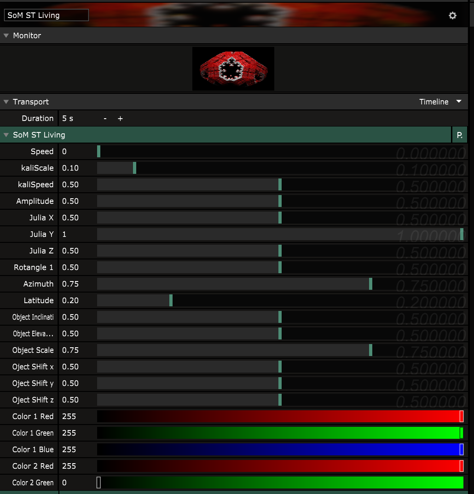
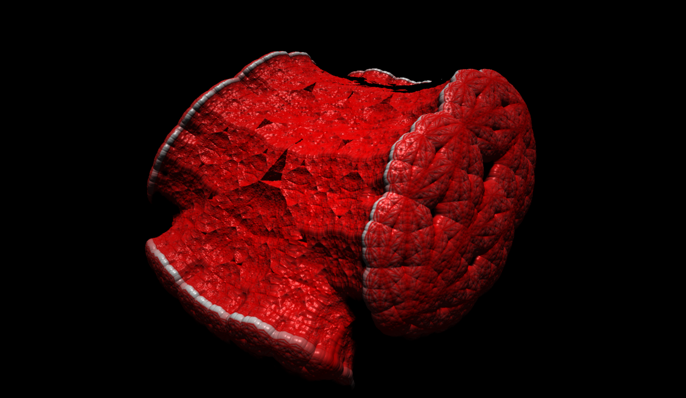
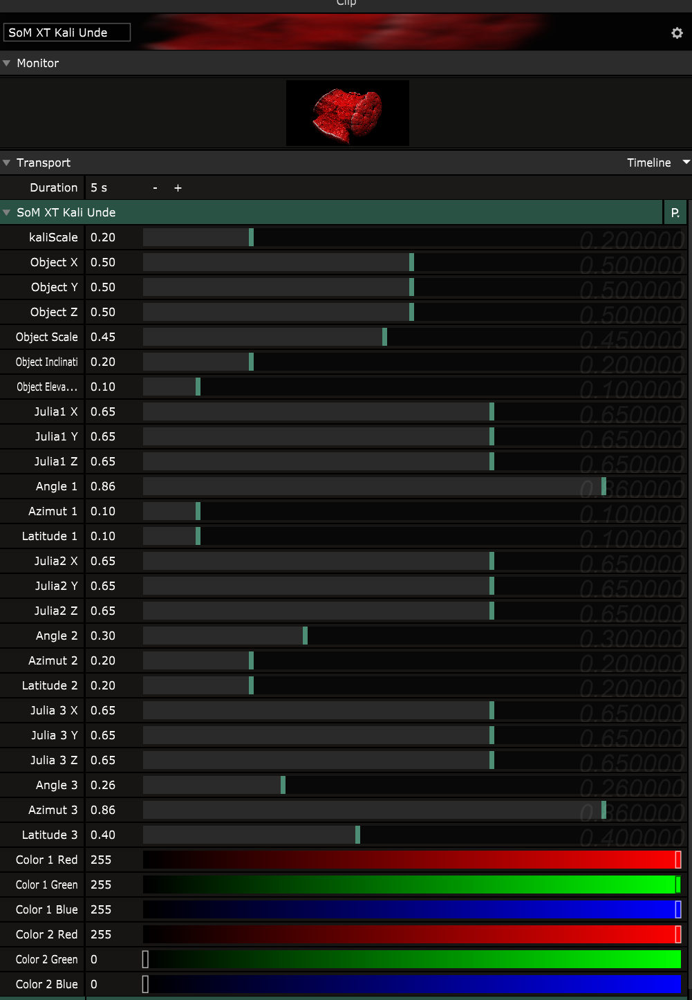

# Spack O Mat Shader Collection

## Source Plugins

### 001 Mandelbrot    
       
| Render | Parameters |
| ------------- | ------------- |
|   |  |

 [Hybrid](https://www.youtube.com/watch?v=L-YTY014Zqo) [Mandelbrot](https://www.wikiwand.com/en/Mandelbrot_set) with 3 seeds.
 The must have with many possibilities, zoom in and vary parameters jut slightly to achieve interesting effects. The seeds should be mapped into ranges. Be careful with the power parameter because it is exponential, and scaled as well so very hard to achieve integer exponents (sigh, this is due to ffgl mapping of params and stuff)
          
 coloring uses simplest escape time coloring
           

           
#### Parameters 
- Julia - switches julia/mandelbrot mode
- CenterX/Y - the zoom center and center of image
-  Zoom   - the zoom of the whole image
- Rotation    - the rotation angle of the image     
- Start of Alternation - iteration when alternation kicks in after this iteration the seeds are alternated                                
- Max Iterations - the maximum number of iterations to use
- Seed 1..3 Real/Imaginary	- the seeds to be used in alternation, the first is pertubation
- Power 1..3  -The power used in the mandelbrot equation 0.3125=1, 0.625=2.0, ... stepp is 0.0625 -8..8 
- Color1/2 - the inner and outer colors as RGB
     

   
#### Status 

ID: SM01
Version: 2.0
 

### 002 Mandelbox  
| Render | Parameters |
| ------------- | ------------- |
|   |    |
 
 2d alternating Hybrid [Mandelbox](https://www.wikiwand.com/en/Mandelbox) with 3 alternating seeds. The mandelbox is
 interesting enough to provide as plugin
         
#### Parameters 
          
- CenterX/Y - the zoom center and center of image
- Zoom - the zoom of the whole image                                                                      
-  Rotation - the rotation angle of the image     
- Start of Alternation - iteration when alternation kicks in after this iteration the seeds are alternated 
- Max Iterations - the maximum number of iterations to use
- Seed 1..3 Real/Imaginary	- the seeds to be used in alternation, the first is pertubation
- Color1/2 - the inner and outer colors as RGB
- Mandelbox Scale - determines the mandelbox scale parameter
                
#### Status 

ID: SM02
Version: 2.0

core functionality, perhaps make scale parameter a alternation option

### 003 Sinewave 1D  
       
| Render | Parameters |
| ------------- | ------------- |                
|    |        |

Renders 3 [Sinewaves](https://www.wikiwand.com/en/Sine_wave) defined by frequency, wavelength and amplitude added together.

This is very basic, but the 3 waves provide enough possibilities, most valuable change is the exponentiation of input parameter for wavelength, which makes it more smooth to change
#### Parameters

- Frequency 1..3 - the speed of the particular sine wave

- Wavelength 1..3  - for each wave defines the number of repetitions (exponential grow)

- Amplitude 1..3 - for each sine wave, the amplitude or height of the sine wave

           
#### Status 
         
ID: SM03
Version: 2.0

core functionality, no changes planned, inversions and line mode can be achieved using other visual plugins/options

### 004 Circle Sun      
         
| Render | Parameters |
| ------------- | ------------- |       
| |           |
            
 the famous suncircle plugin got 3arised providing 3 changeable parts of the circle
 
 the height only goes into one direction
 
 the height and radius parameters are exponential now (making them smooth)
  
            
            
#### Parameters 
                             
 - shape - controls the 'roundness', its the exponent for length calculation estimation ([modelling with distance functions ](https://iquilezles.org/www/articles/distfunctions/distfunctions.htm))
 - rotation - the image rotation
 - pos X/Y - image center x/y 
 - Divisions - number of divisions breaking the shape
 - Color 1..3 - the individual color of each part
 - Radius 1..3  - each shapes starting radius from center of image 
 - Width 1..3 - each shapes cover of a full circle rotation
 - Height 1..3  - each shapes height starting from shapes radius
 - Offset 1..3 - each shapes angle offset 
                                
#### Status 

               
ID: SM04
Version: 2.0

core fun functionality, finished no further additions/changes planned 

## Effect Plugins

### 001 God Rays        
| Render | Parameters |
| ------------- | ------------- |                      
|  |    |

the godray filter works as any othe filter producing a light beam on areas that are below a grayscale limit

#### Parameters

- Exposure - initial light exposure
- Decay - decaying of light per step
- Density - (confusing param) this is the distance over what area the light beams are calulated from start
- Weight - weight of the light beams through addition
- Bias - the image is converted to a gray scale image and any pixel below that value is considered translucent
- Light X/Y - the 2 dimensional position on the image plane of the image center
- Light Radius - the radius of the light bulb
 
#### Status 

ID: SF01
Version 1.0

nice core functionality, not using a pre render step, might receive a gaussian blur/prefilter step in future, and adjustment for transluency options like alpha or luminance
 
## Shadertoy Conversions

### 001 Kali Sea Creature
                                    
| Render | Parameters |
| ------------- | ------------- |   
|   |   

the shadertoy https://www.shadertoy.com/view/Mtf3Rr script by kali is the source for this, it is stripped from its background and parametrisedk, no further changes to code
           
## Parameters
       
- Speed - shadertoy speed value, this is a continous value and will ever increase
- kaliscale - the scale value used in iteration
- kaliSpeed - kalis speed value for inner animation 
- Amplitude - the overall amplitude applied to kalispeed anims
- Julia X/Y/Z - the julia add value 
- Rotangle - the rotation defined by axis (see next)
- Azimuth/Latitude - polar angle axis definition both values range 2PI (repeable)
- Object Inclination/Elevation - object rotation using polar coordinate
- Ojbect Shift X/Y/Z - object translation
- Color 1/2 - the color gradient is applied to the surface of the object
            
### 001 Kali Sea Creature Extended
                                    
| Render | Parameters |
| ------------- | ------------- |   
|   |    
   
the shadertoy https://www.shadertoy.com/view/Mtf3Rr script by kali is the source for this the intrinsic animation is stripped and the shape is 3-ary parametrised using alternation hybridisation in distance estimation method     
                       
## Parameters
       
- kaliScale - kali scale parameter used for all iterations no hybridisation here
- Object Pos X/Y/Z - Object center
- Object Scale - the scale of the object
- Object Inclination/Elevation - the rotation of the object using polar coordinates
- Julia X/Y/Z 1..3 - hybrid each seeds julia value
- Azimuth/Latitude 1..3 - hybrid each seed has a rotation axis that is defined by polar coordinates longitude/latitude both in full 2PI range, for repetition
- Color 1/2 - interpolation between these 2 colors is used to color the surface of the object
           
#### Status 

ID: SX01		
Version 1.0

christian created the highly alternating hybrid and is happy with it, no further changes planned here
