# Spack O Mat Shader Collection

## Source Plugins

### 001 Mandelbrot    
       
|  |  |
| ------------- | ------------- |
| 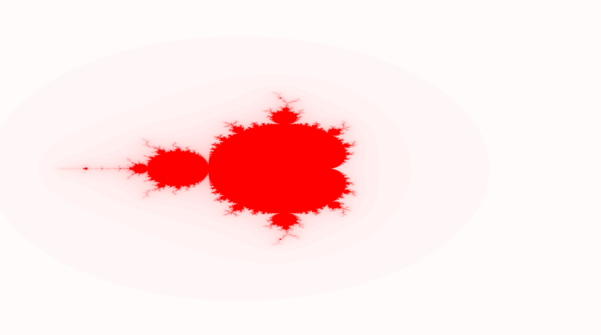  | 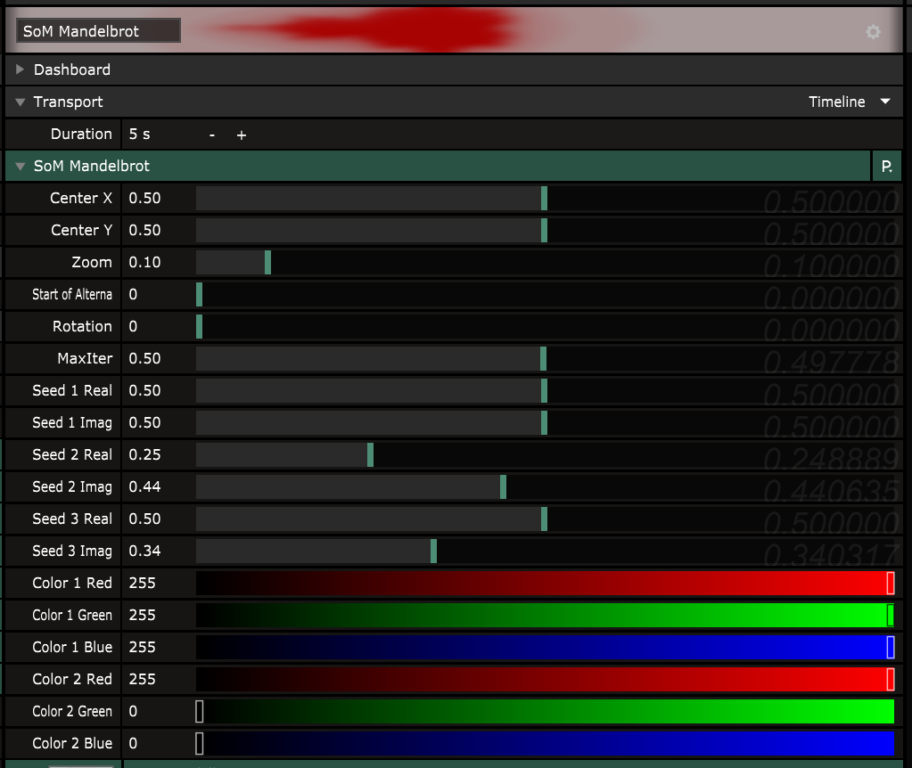 |

2d Alternating Hybrid [Mandelbrot](https://www.wikiwand.com/en/Mandelbrot_set) with 3 seeds.
           
#### Parameters 
- CenterX/Y - the zoom center and center of image
- Zoom - the zoom of the whole image
- Start of Alternation - iteration when alternation kicks in after this iteration the seeds are alternated                             
- Rotation - the rotation angle of the image        
- Max Iterations - the maximum number of iterations to use
- Seed 1..3 Real/Imaginary	- the seeds to be used in alternation, the first is pertubation
- Color1/2 - the inner and outer colors as RGB
     

   
#### Status 

ID: SM01
Version: 2.0

core functionality, perhaps a power parameter will be introduced in future versions

### 002 Mandelbox
|  |  |
| ------------- | ------------- |
| 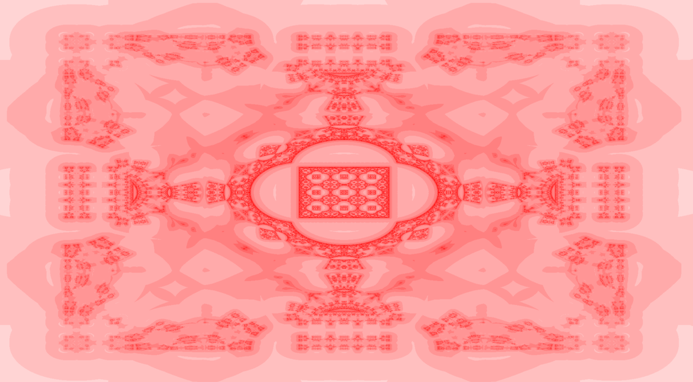  |  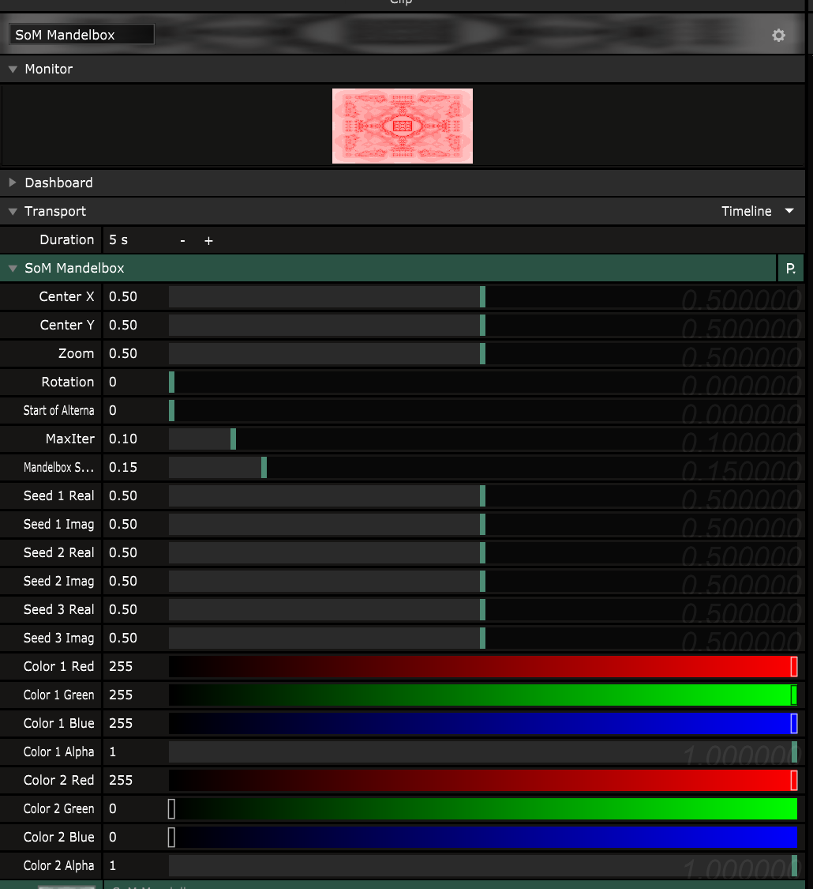  |
 
 2d alternating Hybrid [Mandelbox](https://www.wikiwand.com/en/Mandelbox) with 3 alternating seeds.
         
#### Parameters 
          
- CenterX/Y - the zoom center and center of image
- Zoom - the zoom of the whole image                                                                      
- Rotation - the rotation angle of the image     
- Start of Alternation - iteration when alternation kicks in after this iteration the seeds are alternated 
- Max Iterations - the maximum number of iterations to use
- Seed 1..3 Real/Imaginary	- the seeds to be used in alternation, the first is pertubation
- Color1/2 - the inner and outer colors as RGB
- Mandelbox Scale - determines the mandelbox scale parameter
                
#### Status 

ID: SM02
Version: 2.0

core functionality, perhaps make scale parameter a alternation option

### 003 Sinewave 1D
       
|  |  |
| ------------- | ------------- |                
| 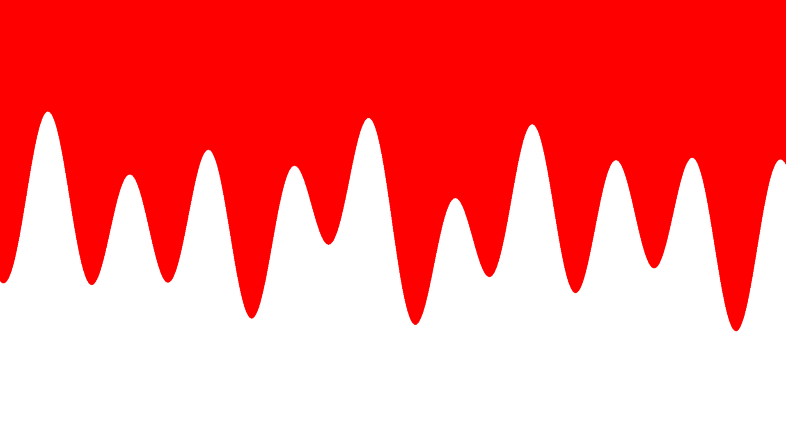   | 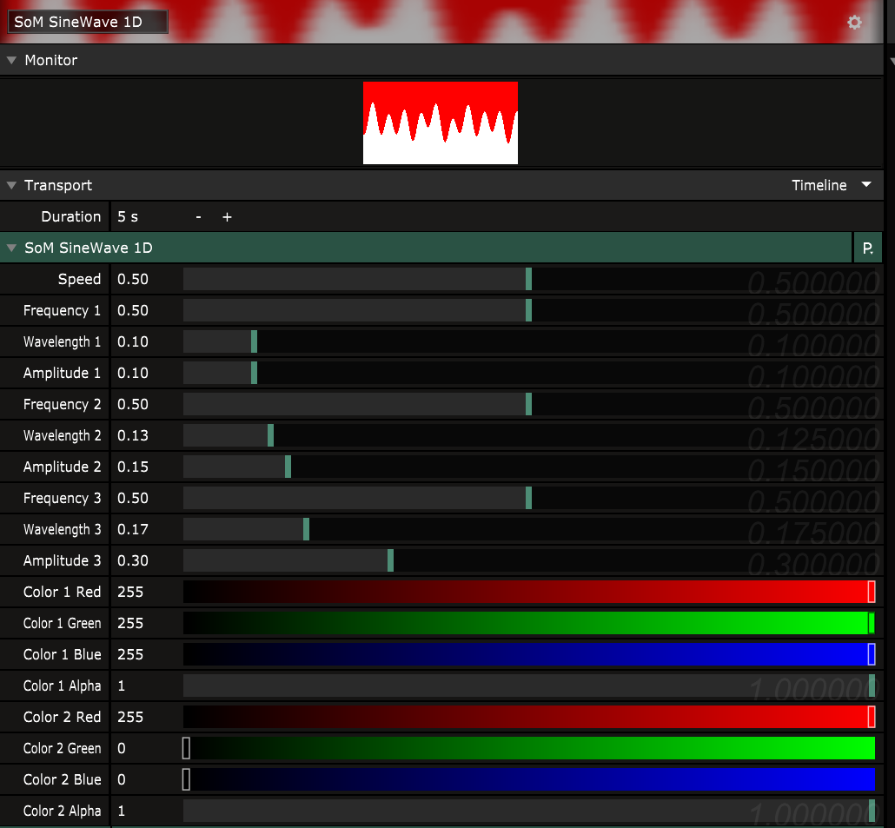       |

Renders 3 [Sinewaves](https://www.wikiwand.com/en/Sine_wave) defined by frequency, wavelength and amplitude added together

#### Parameters

- Frequency 1..3 - the speed of the particular sine wave

- Wavelength 1..3 - for each wave defines the number of repetitions (exponential grow)

- Amplitude 1..3 - for each sine wave, the amplitude or height of the sine wave

           
#### Status 
         
ID: SM03
Version: 2.0

core functionality, no changes planned, inversions and line mode can be achieved using other visual plugins/options

### 004 Circle Sun    
         
|  |  |
| ------------- | ------------- |       
|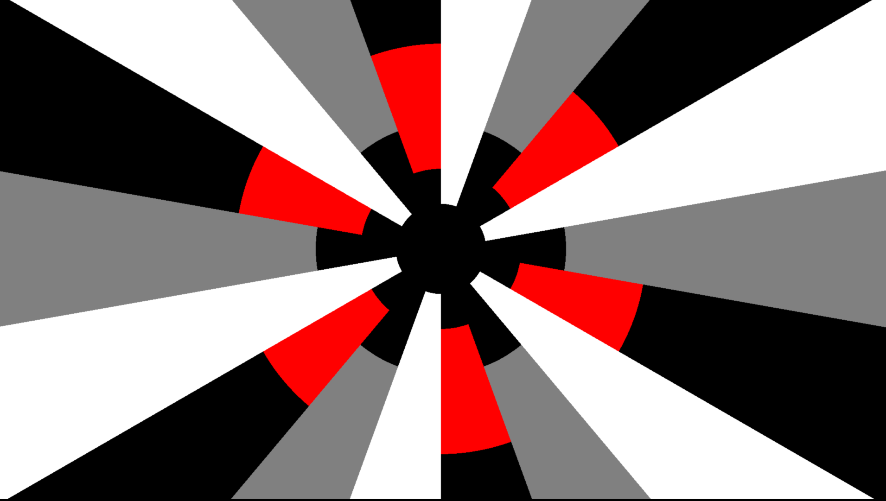 |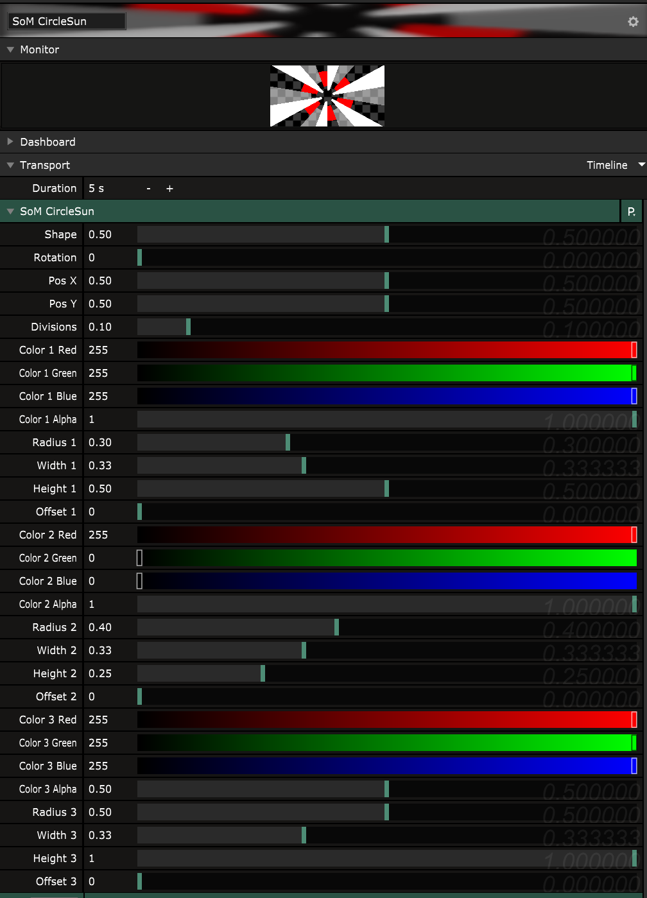           |
          
#### Status 

               
ID: SM04
Version: 2.0

core fun functionality, huge parameter shifts planned, use with caution

## Effect Plugins

### 001 God Rays        
|  |  |
| ------------- | ------------- |                      
|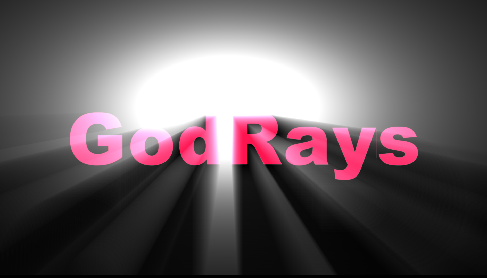  | 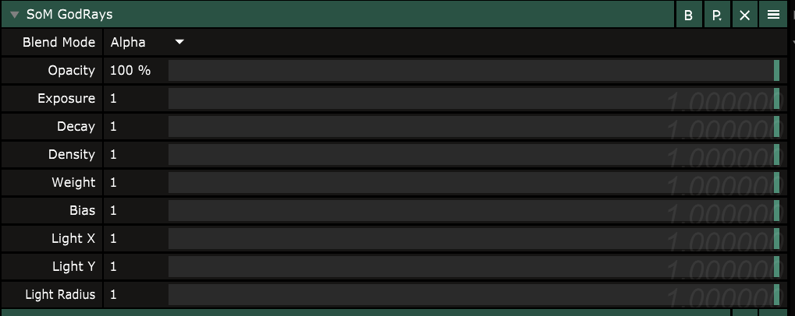   |

the godray filter works as any othe filter producing a light beam on areas that are below a grayscale limit

#### Parameters

- Exposure - initial light exposure
- Decay - decaying of light per step
- Density - (confusing param) this is the distance over what area the light beams are calulated from start
- Weight - weight of the light beams through addition
- Bias - the image is converted to a gray scale image and any pixel below that value is considered translucent
- Light X/Y - the 2 dimensional position on the image plane of the image center
- Light Radius - the radius of the light bulb
 
#### Status 

ID: SF01
Version 1.0

nice core functionality, not using a pre render step, might receive a gaussian blur/prefilter step in future, and adjustment for transluency options like alpha or luminance
 
## Shadertoy Conversions

### 001 Kali Sea Creature
                                    
|  |  |
| ------------- | ------------- |   
|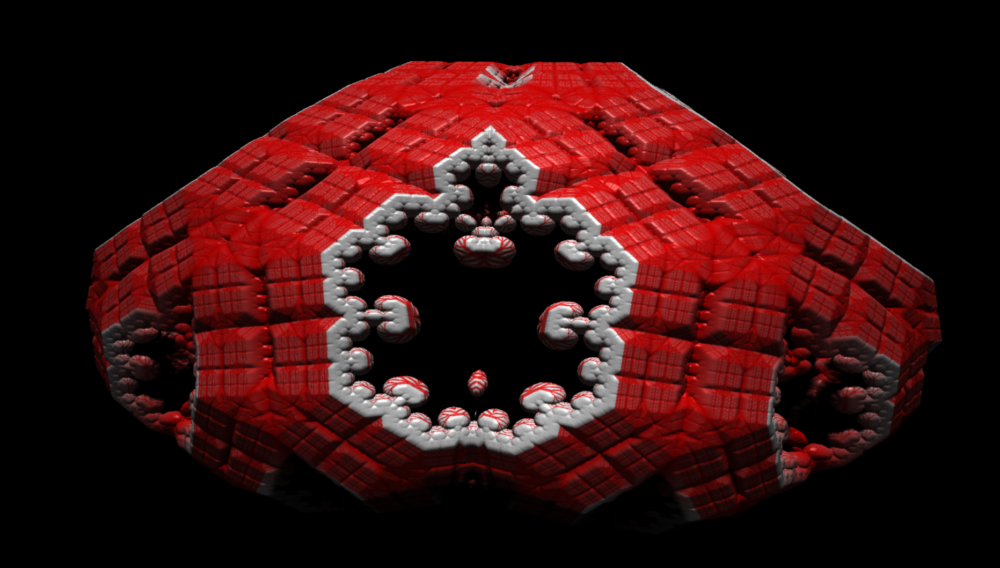   |
           
#### Status 

ID: ST01
Version 1.0

phew, this is a resolume variant of one of the greatest shader writers in the world - and a pretty good friend of mine - kali. He constructs
the most fantastic structures out of the code, the shader used here is famous for its lifelike own animations controlled by the shadertoy time
parameter

additionally christian packed in a bunch of alternating parameters, namely the rotationAngle this is heavy uncertain if it will stay this way
 so no further parameter explanation for now here
